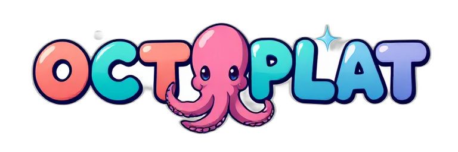
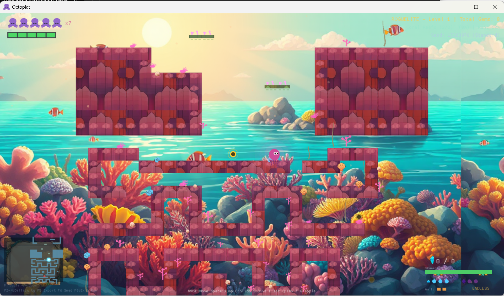

<p align="center">
  
</p>

<p align="center">
  <strong>A procedurally-generated roguelite platformer where you play as an octopus diving through ocean depths!</strong>
</p>

<p align="center">
  <a href="#features">Features</a> •
  <a href="#screenshot">Screenshot</a> •
  <a href="#installation">Installation</a> •
  <a href="#controls">Controls</a> •
  <a href="#biomes">Biomes</a> •
  <a href="#architecture">Architecture</a>
</p>

<p align="center">
  
  
  
  
</p>

---

## Screenshot

<p align="center">
  
</p>

---

## Features

**Dive into a roguelite adventure** through vibrant underwater worlds! Master fluid movement mechanics as you jet-boost through coral reefs, wall-climb shipwrecks, and ink-cloud your way past patrolling crabs.

- **Roguelite Runs** — Every playthrough links procedurally-generated segments into unique journeys through 8 ocean biomes
- **Fluid Movement** — Coyote time, jump buffering, and corner correction make platforming feel *just right*
- **Water-Powered Abilities**
  - **Jet Boost** — Propel in any direction; dive downward to smash through breakable blocks
  - **Wall Climb** — Cling and scale walls with stamina-based climbing and wall jumps
  - **Ink Cloud** — Pop a defensive burst for temporary invincibility
- **Challenging Hazards** — Dodge patrolling crabs, bobbing pufferfish, spikes, and crumbling platforms
- **Immersive Audio** — Each biome features its own music track and ambient ocean sounds
- **Gamepad Ready** — Full controller support alongside keyboard controls

---

## Installation

### Requirements

- Rust (2021 edition)
- Cargo

### Build & Run

```bash
# Clone the repository
git clone https://github.com/yourusername/octoplat.git
cd octoplat

# Build and run (release mode recommended)
cargo run --release
```

### Other Commands

```bash
cargo build                  # Debug build
cargo build --release        # Optimized release build
cargo test                   # Run all tests
cargo clippy                 # Lint check
```

### Cross-compile for Windows

```bash
./scripts/build-windows.sh
```

---

## Controls

| Action | Keyboard | Gamepad |
|:-------|:---------|:--------|
| Move | Arrow Keys / WASD | Left Stick |
| Jump | Space | A / Cross |
| Sprint | Shift | LT / L2 |
| Jet Boost | E | RT / R2 |
| Ink Cloud | Q | RB / R1 |
| Pause | P / Escape | Start |

---

## Biomes

Dive deeper through **8 unique underwater environments**, each with its own visual style, music, and challenges:

| # | Biome | Description |
|:-:|:------|:------------|
| 1 | **Ocean Depths** | Calm waters to learn the ropes |
| 2 | **Coral Reefs** | Colorful formations with vertical challenges |
| 3 | **Tropical Shore** | Warm sunlit waters near the surface |
| 4 | **Shipwreck** | Tight corridors in sunken vessels |
| 5 | **Arctic Waters** | Icy platforms under northern lights |
| 6 | **Volcanic Vents** | Dangerous timing-based hazards |
| 7 | **Sunken Ruins** | Ancient mysteries to explore |
| 8 | **The Abyss** | The ultimate challenge awaits... |

---

## Architecture

Octoplat uses a **two-crate workspace** for clean separation of concerns:

```
octoplat/
├── crates/
│   ├── octoplat-core/    # Pure Rust library (no graphics)
│   │   ├── level/        # Tilemaps, decorations, markers
│   │   ├── procgen/      # Procedural generation & validation
│   │   ├── physics/      # Collision detection
│   │   └── state/        # Game state & saves
│   │
│   └── octoplat-game/    # Game runtime (macroquad)
│       ├── player/       # State machine & abilities
│       ├── rendering/    # Tiles, shaders, effects
│       ├── roguelite/    # Run progression system
│       ├── hazards/      # Enemies (Crab, Pufferfish)
│       └── ui/           # Menus & transitions
│
└── assets/               # Sprites, audio, level segments
```

### Design Patterns

- **State Machine** — `AppState` enum drives game flow (Title → Playing → Paused → GameOver...)
- **Modular Controllers** — Dedicated subsystems for gameplay, effects, UI, and progression
- **Action-Based Updates** — `GameActions` enum for explicit, traceable state changes

---

## Testing

Integration tests cover the core systems:

```bash
cargo test --test procgen    # Level generation & validation
cargo test --test player     # Player state machine
cargo test --test scenarios  # Gameplay scenarios
cargo test --test physics    # Collision detection
```

---

## Platform Notes

| | |
|:--|:--|
| **Window** | 1280×720, resizable |
| **Audio** | Gracefully degrades without ALSA (e.g., WSL) |
| **Supported** | Windows, Linux, macOS |

---

## Contributing

Contributions are welcome! Feel free to:

1. Fork the repository
2. Create a feature branch (`git checkout -b feature/amazing-feature`)
3. Commit your changes (`git commit -m 'Add amazing feature'`)
4. Push to the branch (`git push origin feature/amazing-feature`)
5. Open a Pull Request

---

## License

This project is licensed under the MIT License — see the [LICENSE](LICENSE) file for details.

---

<p align="center">
  Built with 🐙 and Rust
</p>
